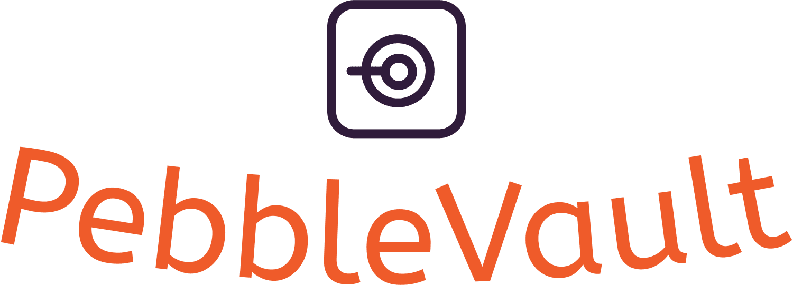

# PebbleVault

---
Welcome to PebbleVault, the database that rocks! 🚀 Imagine a world where pebbles are more than just tiny stones; they are the building blocks of your data dreams. PebbleVault is a memory database with a MySQL twist, all wrapped up in the cozy, memory-safe blanket of Rust. It’s like having a pet rock collection, but for grown-ups with serious data needs!

## Why PebbleVault? 🌟
- Speed of a Cheetah: With memory-based storage, your pebbles are accessible at lightning speed.
- Safety of a Vault: Thanks to Rust, your data is as safe as pebbles in a vault. No more worrying about memory leaks or data corruption.
- Flexibility of a Gymnast: Easily throw your pebbles to MySQL when you need more permanent storage. It's like tossing a pebble across a lake, but with fewer ripples and more data integrity.
- Simplicity of a Skipping Stone: Simple operations to add, drop, and throw pebbles make managing your data as easy as skipping stones on a serene pond.
- Amazing dad jokes
## Key Features 🎉
- In-Memory Speed: Keep your pebbles in memory for ultra-fast access.
- MySQL Persistence: Throw pebbles to MySQL for long-term storage, ensuring your data stays solid.
- Rust Reliability: Built with Rust, so your pebbles are safe and sound, protected from the elements (and by elements, we mean bugs).
## How It Works 🔧
- Collect your pebbles (data objects) and store them in memory for rapid access.
- Drop pebbles you no longer need, freeing up memory or disk and lightening your load.
- Throw pebbles to disk when you want them to settle down and enjoy a longer stay.

## Installation 🛠️
To get started with PebbleVault, just run:
```sh
cargo install pebblevault
```
Then, initialize your vault:

```rs
use pebblevault::Vault;

let vault = Vault::new();
vault.collect("my_precious_pebble", data);
vault.throw("my_precious_pebble");
vault.drop("my_precious_pebble");
```

## Contribute 🤝
Do you have ideas to make PebbleVault even better? Want to add more fun to our pebble party? Join us in making PebbleVault the best place for all your pebble-keeping needs! Check out our contributing guide and start throwing your ideas our way.

## License 📜
PebbleVault is licensed under the Apache 2.0 License. Rock on! 🤘
